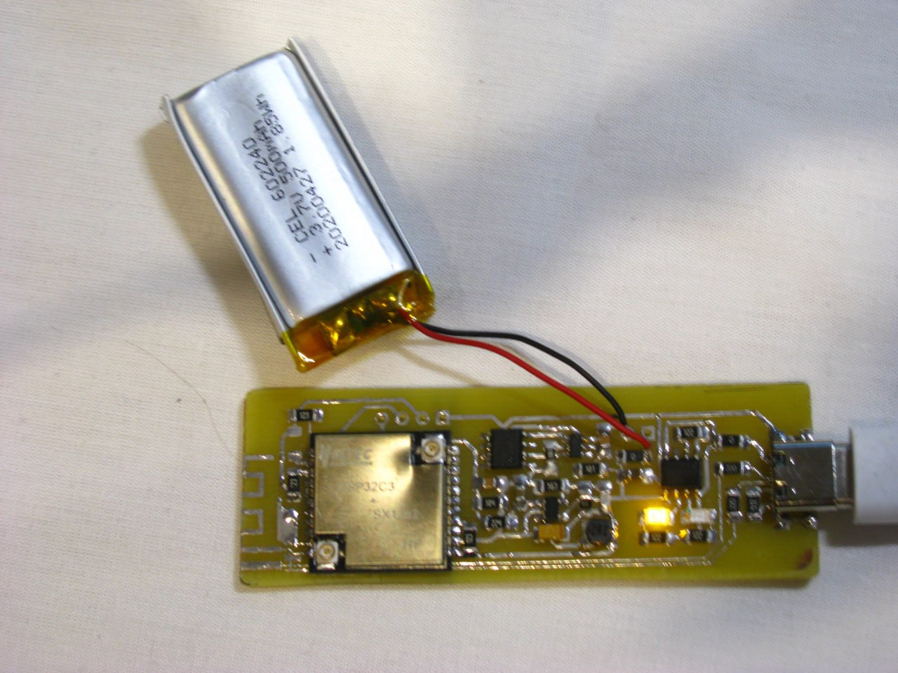
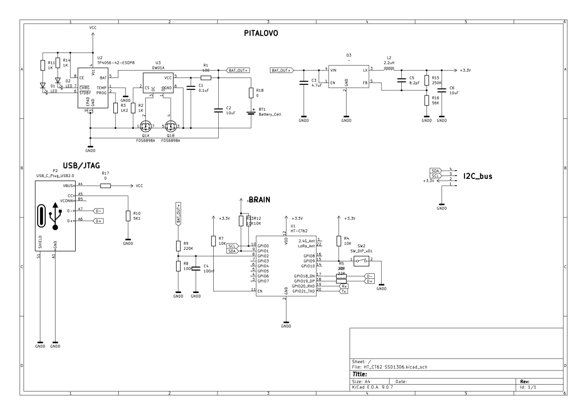
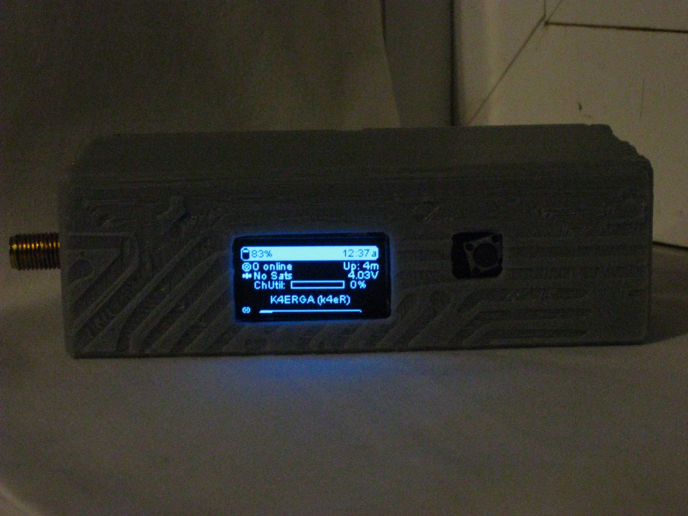

# 
# EHTMesh

EHTMesh is the simplest implementation of a Meshtastic/Meshcore device on the HT-CT62.


# Schematic





| Name                             | Description |
| ---------------------------------------- | ----------- |
|**Capacitors:**                   | |
|C1 | 0.1uF |
|C2,C6 | 10uF|
|C3   |  4.7uF|
|C4   |  100nf|
|C5   |  8.2pF|
|**Diode:**| |
|D1,D2  | LED|
|**Connectors:**||
|J3     |Conn_01x04_Pin|
|P2     | USB_C_Plug|
|**Inductors:**||
|L2     | 2.2uH|
|**Transistor:**||
|Q1, Q2  |  FDS6898A|
|**Resistors:**||
|R1            | 100|
|R2,R11,R14    | 1K|
|R3            | 1K2|
|R4,R7,R12,R13 | 10K|
|R5,R6         | 22R|
|R8            | 100K|
|R9            | 220K|
|R10           | 5K1|
|R15           | 250K|
|R16           | 56K|
|R17,R18       |0|
|**IC:**||
|U1            | HT-CT62|
|U2            | TP4056-42-ESOP8|
|D3            | RT8059|

# Case

A case with hot-swappable battery support has been designed for this project.

https://www.printables.com/model/1636637-ht-ct62-meshtastic-case-with-added-battery 



# Firmware

Install the JTAG driver

```
Invoke-WebRequest 'https://dl.espressif.com/dl/idf-env/idf-env.exe' -OutFile .\idf-env.exe; .\idf-env.exe driver install --espressif
```

Download Flash Download Tool  
https://docs.espressif.com/projects/esp-test-tools/en/latest/esp32/production_stage/tools/flash_download_tool.html

Connect the device to the PC while holding the button.  
The node should appear as **USB JTAG/serial debug unit**.

Launch **Flash Download Tool** and select **ESP32-C3**.


Enable the checkbox, specify the path to `firmware.bin`, and set the memory address to `0x10000`.


In the lower right corner select the port (most likely there will be only one) and press **Start**.

> ⚠️ The firmware in this repository will not be updated. If you need newer versions, you must compile it yourself using the guide below.

---

# Compiling firmware using VS Code

Install **git**  
https://git-scm.com/install/windows

During installation select the option:

```
Add a Git Bash Profile to Windows Terminal
```


Install **VS Code**  
https://code.visualstudio.com/download

Download the archive and open it in VS Code.

https://github.com/meshtastic/firmware/archive/refs/heads/develop.zip

In the **Extensions** tab search for `PlatformIO` and install it.


Add your own or a prepared `variant.h` file to  
`\variants\esp32c3\heltec_esp32c3`

Also add `power.h` to the `\src\` directory.

Then run in the terminal:

```
C:\Users\Username\.platformio\penv\Scripts\platformio.exe run -e heltec-ht62-esp32c3-sx1262
```

Path to the compiled firmware:

```
.pio/build/heltec-ht62-esp32c3-sx1262/... .factory.bin
```

For flashing use **only the file** with the `.factory.bin` extension.

---

# Compiling firmware without VS Code

All actions below are intended **only for Debian-based Linux distributions**.

```
sudo apt install git                                            # Install git
sudo apt install python3-venv                                   # Install venv package
python -m venv ~/.pio_venv                                      # Create environment
source ~/.pio_venv/bin/activate                                 # Activate environment
pip install platformio                                          # Install PlatformIO
git clone https://github.com/meshtastic/firmware && cd firmware # Download repository
pio run -e heltec-ht62-esp32c3-sx1262                           # Compile firmware
```

Path to the compiled firmware:

```
~/firmware/.pio/build/heltec-ht62-esp32c3-sx1262/... .factory.bin
```

For flashing use **only the file** with the `.factory.bin` extension.

---

# Firmware modifications

## In the file `\src\power.h`

| Line                                                                                 | Description |
| ------------------------------------------------------------------------------------ | ----------- |
| `#define OCV_ARRAY 4190, 4078, 4017, 3969, 3887, 3818, 3798, 3791, 3766, 3712, 3100` | Battery percentage voltage steps (4190 = 100%, 3100 = 0%). These values can be adjusted if needed |

---

## In the file `\variants\esp32c3\heltec_esp32c3\variant.h`

| Line                                     | Description |
| ---------------------------------------- | ----------- |
| `#define HAS_SCREEN`                     | Enables display support |
| `#define HAS_GPS`                        | Enables GPS support |
| `#define GPS_RX_PIN`                     | GPS data receive pin |
| `#define GPS_TX_PIN`                     | GPS data transmit pin |
| `#define BUTTON_PIN`                     | Button pin |
| `#define I2C_SDA`                        | I2C data pin |
| `#define I2C_SCL`                        | I2C clock pin |
| `#define BATTERY_PIN 2`                  | Battery connection pin to the microcontroller |
| `#define ADC_CHANNEL ADC1_GPIO2_CHANNEL` | Defines ADC channel |
| `#define ADC_MULTIPLIER 3.16`            | ADC scaling factor. Adjust if battery voltage/percentage is displayed incorrectly |
| `#define BATTERY_SENSE_SAMPLES 5`        | Number of measurements used for averaging |
