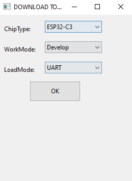
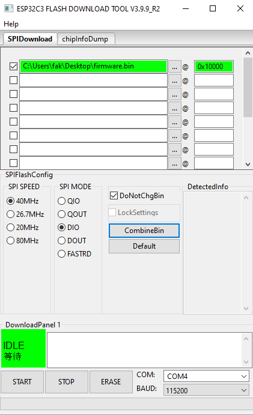
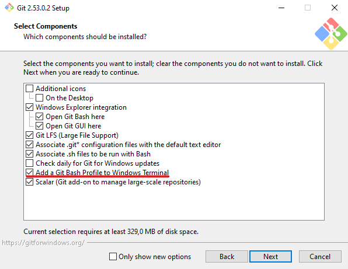
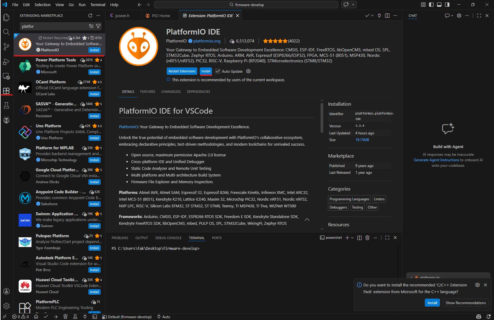

# HT-CT-62

HT-CT-62 - это один из возможных вариантов устройств на базе HT-CT62.

# Прошивка

Устанавливаем jtag driver

```
Invoke-WebRequest 'https://dl.espressif.com/dl/idf-env/idf-env.exe' -OutFile .\idf-env.exe; .\idf-env.exe driver install --espressif
```

Скачиваем Flash Download Tool
https://docs.espressif.com/projects/esp-test-tools/en/latest/esp32/production_stage/tools/flash_download_tool.html

Подключаем устройство к ПК и удерживаем кнопку.
Нода должна определится как **USB JTAG/serial debug unit**.

Запускаем Flash Download Tool и выбираем **ESP32-C3**.



Выставляем галочку, указываем путь до `firmware.bin` и в правой ячейке указываем участок памяти `0x10000`.



В правом нижнем углу выбираем порт(он скорее всего будет один) и нажимаем **Start**.

> ⚠️ Прошивка в репозитории обновляться не будет, поэтому если нужна свежая версия — её необходимо компилировать по гайду ниже.

---

# Компиляция прошивки с помощью VS Code

Устанавливаем **git**
https://git-scm.com/install/windows

В окне установки нужно выбрать пункт:

```
Add a Git Bash Profile to Windows Terminal
```



Устанавливаем **VS Code**
https://code.visualstudio.com/download

Скачиваем архив и открываем его в VS Code.

https://github.com/meshtastic/firmware/archive/refs/heads/develop.zip

В поиске вкладки **Extensions** пишем `PlatformIO` и устанавливаем.



После установки пишем в терминал:

```
 C:\Users\Имя_пользователя\.platformio\penv\Scripts\platformio.exe run -e heltec-ht62-esp32c3-sx1262
```

Путь к готовой прошивке:

```
.pio/build/heltec-ht62-esp32c3-sx1262/... .factory.bin
```

Для прошивки используем **исключительно файл** с расширением `.factory.bin`.

---

# Компиляция прошивки без VS Code

Все указанные действия рассчитаны исключительно для **Linux дистрибутивов на основе Debian**.

```
sudo apt install git                                            # Установка git
sudo apt install python3-venv                                   # Установка пакета Venv
python -m venv ~/.pio_venv                                      # Создание окружения
source ~/.pio_venv/bin/activate                                 # Активация окружения
pip install platformio                                          # Установка PlatformIO
git clone https://github.com/meshtastic/firmware && cd firmware # Скачивание репозитория
pio run -e heltec-ht62-esp32c3-sx1262                           # Компиляция прошивки
```

Путь к готовой прошивке:

```
~/firmware/.pio/build/heltec-ht62-esp32c3-sx1262/... .factory.bin
```

Для прошивки используем **исключительно файл** с расширением `.factory.bin`.

---

# Изменения в прошивке

## В файле `/src/power.h`

| Строчка                                                                              | Назначение                                                                                       |
| ------------------------------------------------------------------------------------ | ------------------------------------------------------------------------------------------------ |
| `#define OCV_ARRAY 4190, 4078, 4017, 3969, 3887, 3818, 3798, 3791, 3766, 3712, 3100` | Шаги процентов заряда в напряжении (4190 = 100%, 3100 = 0%). При желании можно поменять значения |

---

## В файле `\variants\esp32c3\heltec_esp32c3\variant.h`

| Строчка                                  | Назначение                                                                                        |
| ---------------------------------------- | ------------------------------------------------------------------------------------------------- |
| `#define HAS_SCREEN`                     | Включение работы экрана                                                                           |
| `#define HAS_GPS`                        | Включение работы GPS                                                                              |
| `#define GPS_RX_PIN`                     | Пин приёма GPS данных                                                                             |
| `#define GPS_TX_PIN`                     | Пин передачи GPS данных                                                                           |
| `#define BUTTON_PIN`                     | Пин кнопки                                                                                        |
| `#define I2C_SDA`                        | Пин данных I2C                                                                                    |
| `#define I2C_SCL`                        | Пин тактирования I2C                                                                              |
| `#define BATTERY_PIN 2`                  | Пин подключения АКБ к микроконтроллеру                                                            |
| `#define ADC_CHANNEL ADC1_GPIO2_CHANNEL` | Определяет канал АЦП                                                                              |
| `#define ADC_MULTIPLIER 3.16`            | Коэффициент значения с АЦП. Если показывает заряд/напряжение неправильно — можно немного изменить |
| `#define BATTERY_SENSE_SAMPLES 5`        | Количество измерений для усреднения                                                               |
